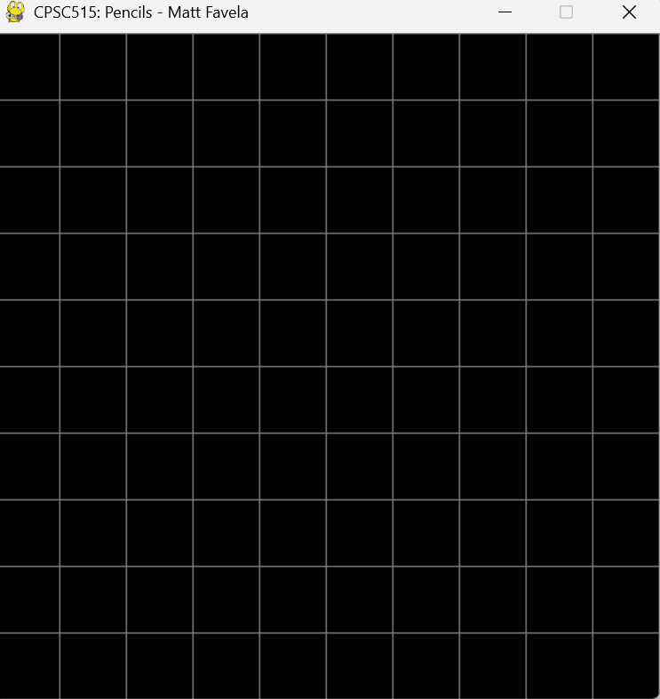
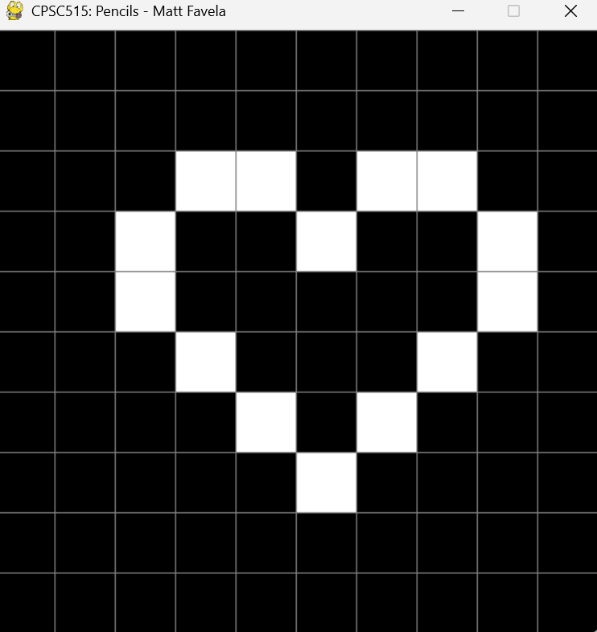

# Assignment 1 Report

Author: By Matthew Favela

## Task 1

### Methods and Implementation

To complete the task of creating a grayscale canvas I needed to setup a few main components:
1. A way to convert a 32-bit float to 3, 8-bit integers for a total of 24 bits in size (Theoretically), is by mapping the [0,1] float to a [0,255] uint8 value.
2. A way to ensure that the canvas_type is set to grayscale.
3. To change the canvas_type to a grayscale mode.
My approach for creating the floatToInt() method is by taking the intensity float value and multiplying it by 255. Next to create the initGrayCanvas() function I needed to make the integer value either 0 or 255 if the intensity float value is a higher value than the grayscale threshhold. Afterwards, I updated the argument that defines the canvas_type to be set to grayscale. An important factor to also keep in mind is if the canvas_type color gets passed in, I would need to pass along the original intensity which is the float value * 255.

## Task 2

### Methods and Implementation
To create a heart in grayscale on the canvas I had to figure out a way to map the mouses x and y coordinates to the indicies of the matrix I defined. This is because one pixel is technically 50x50 pixels in a matrix of 10x10, so I had to map the coordinate between 0-500 between one of the 10 pixels it fell into. There is also an issue of the origin being set at the top-left when it should be in the bottom-left, so I had to do some transformations to reverse the origin used.

My approach to this problem was to:
1. Create a working way to map mouse_x and mouse_y coordinates to the correct indecies based on which "bucket" of pixels its in. This is to determine which group of 50x50 pixels belongs to each index.
2. Next, I would need a way of chaning the intensity of the group of pixels in that "bucket" to 255 intensity or ON.
3. Finally I wanted a way to print out the array index of a pixel I clicked on, so that I can compile a list of indicies to turn on their intensities.

I started by printing out the values and trying to transform them each time to the value I was expecting. I ended up deciding on starting by flipping the origin by taking the row value, minus the width of array (in pixel size) * the size of a pixel. Then I multiplied this value by -1 to invert the value, which made the correct value from initially a negative value to a positive value. From here I correctly mapped the x and y coordinates to what they were supposed to be with a bottom-left origin.

Next, I had to determine how many "cells" or in mouse coordinates would be equivalent to one pixel or "bucket" of 50x50 pixels on the canvas in both the x and y directions, so I could figure out which index in the x and y values the pixel corresponded to such as [1,2] [3,6] etc. This helped me to then apply what I did in the first assignment, to this 2d matrix. 

Then I used the technique from Assignment 0 of mapping the 2D matrix's coordinates to a 1D array so that I had an exact index of the pixel on the image. So when later referencing the data array, I can reference the correct index based on where the pixel is in the 2D matrix.

Finally, to create the heart, I ran the program and would click on a box to have it's index be printed out. Then I put those indicies into a list and turned their intensity on. Since we're in grayscale mode, the pixels fully turned on which mimic-ed the Figure 3 example from the homework 1 assignment.

## Task 3

### Methods and Implementation

To create a way to turn on the intensity of a pixel on my canvas that I click, I would need to get the specific index of the pixel being clicked. Then take the index value and turn on its intensity.

My approach to this problem was to:
1. Get the mouse x and y coordinates when the user clicks on the canvas.
2. Convert the coordinates to an index for our data array, which will help us identify the pixel to intesify.
3. Reference the index in the data array and turn on the intensity of those pixels.

I started by using the PyGame event of holding the left mouse button, which normally was used for print statements. I altered the code to get the mouses coordinate positions on the canvas and turn on the intensity of that specific pixel.

## Task 4

### Methods and Implementation

To complete this task I created a initializeColorCanvas() function that would activate if instead of passing in grayscale to the canvas_type argument, I used the "color" keyword. Then if this is detected, the canvas would initialize with just the aqua background and no gridlines this time.

## Task 5

### Methods and Implementation

For task 5 I needed to create a stamp that would generate a flower at the index I click. This means I would need to setup colors for the flower petals and the center pixel. I also had to intensify the indicies before and after the index being clicked. As well as, add the width of the canvas to get the pixel above and subtract the width to get the pixel below.

My approach to this is to:
1. Wait for the right mouse button click to happen, with a flag being set of right mouse clicked being equal to false. Once the mouse is clicked this becomes True and activated the if statement towards the bottom of the loop.
2. If a right mouse button click it detected, we will reference the canvas and cal the draw flower method, as well as pass in the mouse x and y coordinates as arguments. Once this is finished, we will reset the right mouse clicked flag to False.
3. In the draw flower method, I will have to use the same system as before, except explicitly pass in RGBA values since we are using color. I will also need to change the center index to a white RGBA value and the pixels before, after, above, and below to a yellow color.

The implementation process of this method felt very straight forward after completing the previous tasks, however I did have to tinker around with the index values being changes so that it would be specifically on the users cursor.

## Task 6

### Methods and Implementation

For my final task I had to figure out a way to implement a pencil feature, where the user can hold left mouse button to draw white pixels on the canvas.
My approach to this is to:
1. Implement a way when the left mouse button event is firing, to check which pixel index is being clicked on at the current time
2. Then take that index and use the data array to change it's intensity to on.
The implementation for this feature felt more easier and straightforward to implement than the last. I feel like I could've improved the code by doing a check if the pixels intensity is already on instead of reapplying the change to the pixels intensity.