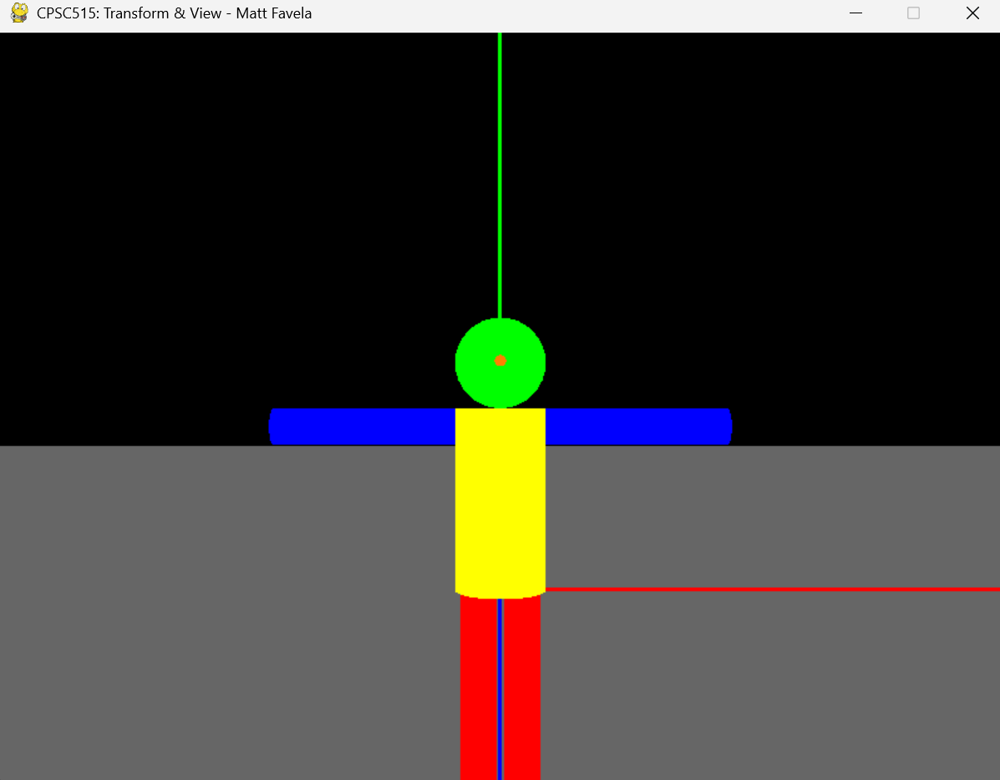
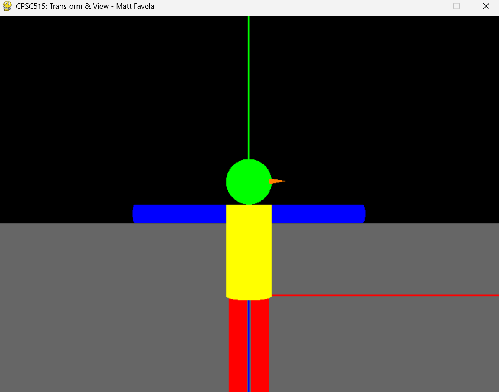
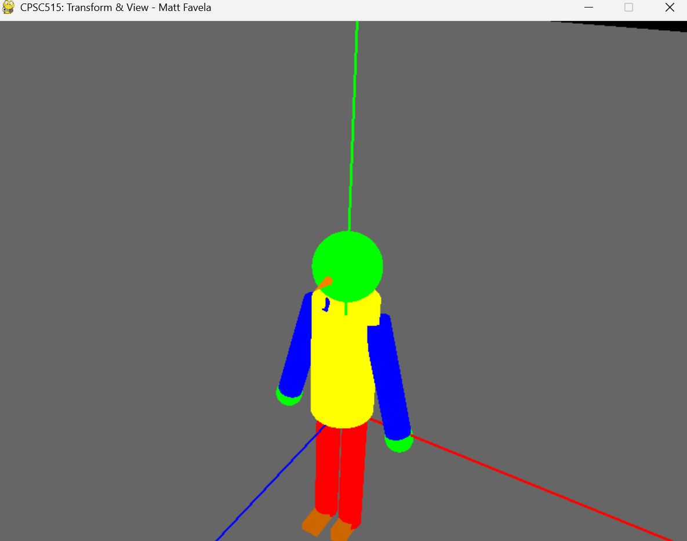
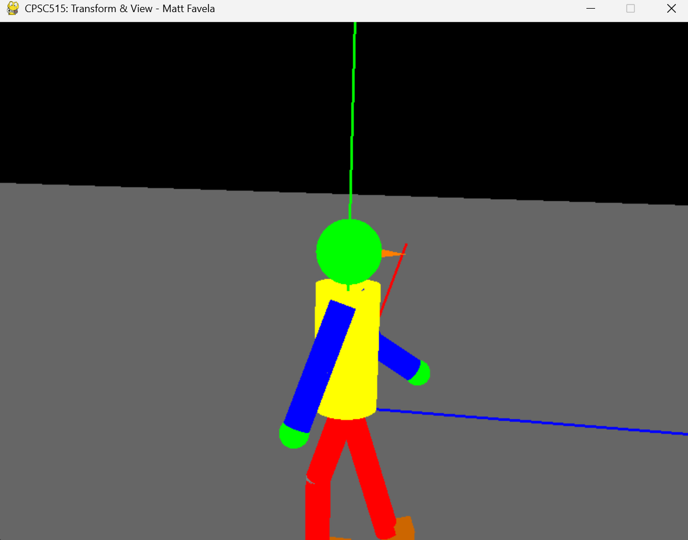
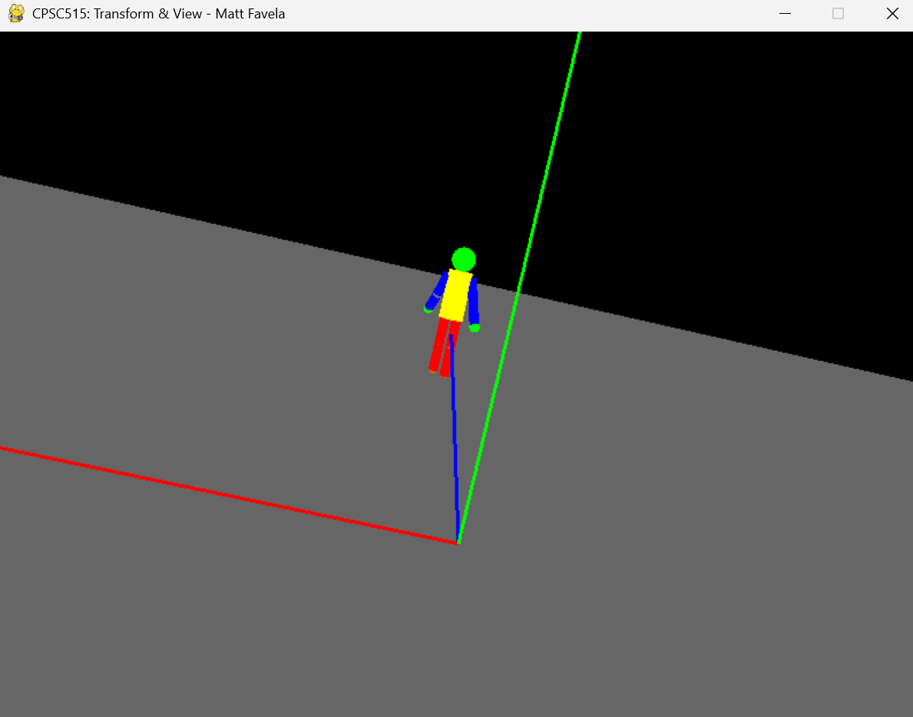
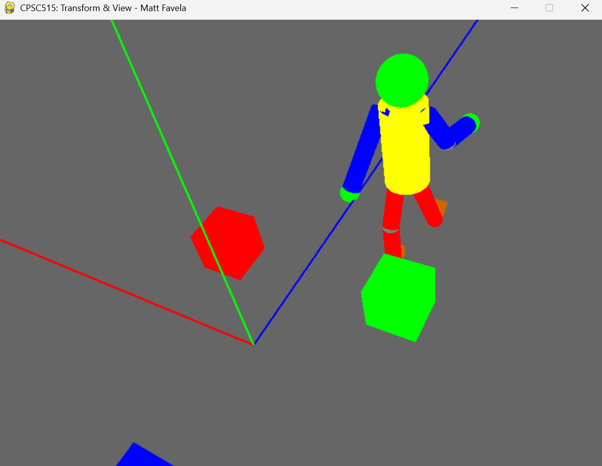
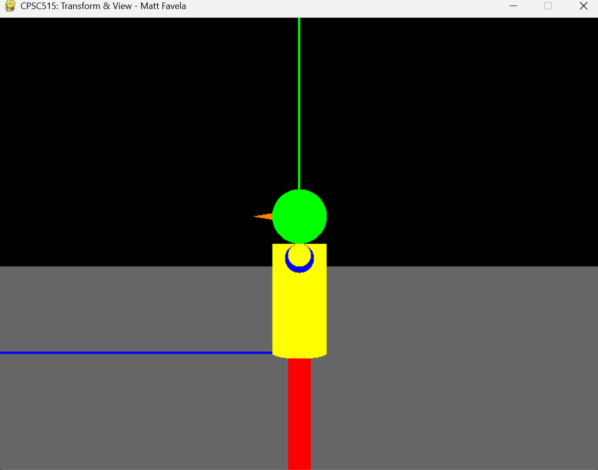
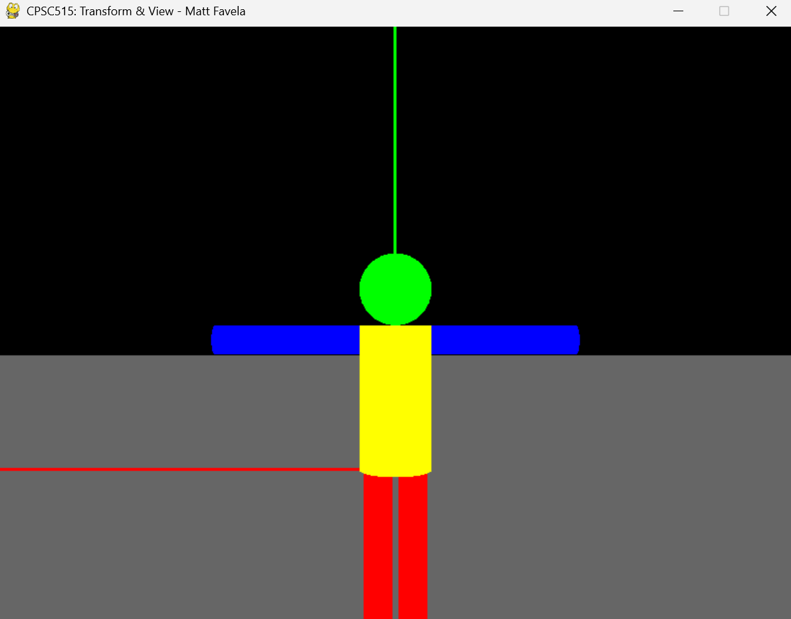
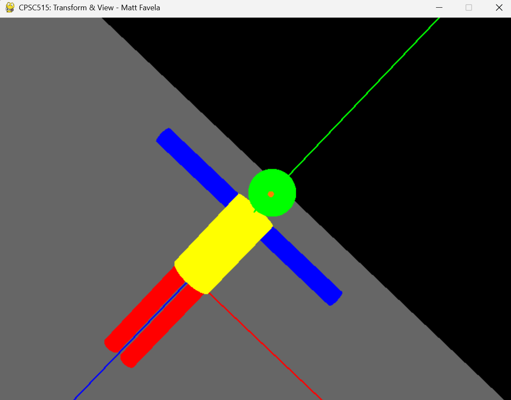
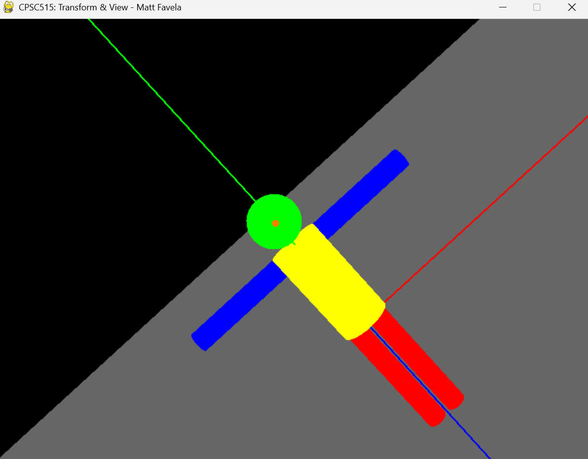

# Project 2 Report

Author: By Matthew Favela

## Task 1: Create a Basic Scarecrow

### Methods and Implementation

To build the basic Scarecrow, I had to stack and color each 3D shape correctly, making sure everything lined up as per the project specs. I started by focusing on the core components:
1. First, I drew the head with `gluSphere()` setting the radius to 2.5 and coloring it green to match the guideline. I placed it so its center was well above the torso, at `(0, 12.5, 0)` relative to the torso's center, using `glTranslatef(0, 12.5, 0)` after positioning the torso.
2. Next, I attached the nose using `gluCylinder()` with a base radius of 0.3 and height of 1.8, colored red for contrast. I had to offset it slightly forward from the head's surface with `glTranslatef(0, 0, 2.5)` and rotate it to align.
3. Then, I added the torso via `gluCylinder()`, giving it a radius of 2.5 and a length of 10, colored yellow to stand out. I centered it at the origin and oriented it vertically using `glRotatef(-90, 1, 0, 0)`.
4. After that, I placed the arms and legs as cylinders with a radius of 1.0. The arms (length = 10, colored blue) were translated to the sides of the torso at `glTranslatef(±2.5, 9.0, 0.0)` and rotated 90 degrees around their local Y-axis to point outwards (`glRotatef(±90, 0, 1, 0)`), while the legs (length = 12, colored red) were positioned below at `glTranslatef(±1.2, 0.0, 0.0)` and rotated 90 degrees around their local X-axis to point downwards (`glRotatef(90, 1, 0, 0)`) to ground the model.
5. Finally, I wrapped each draw call in `glPushMatrix()` and `glPopMatrix()` so transformations stay local to each part. This was crucial to prevent one part’s rotation or translation from messing up the others, keeping the hierarchy clean.

I spent some time tweaking the exact positions to avoid overlaps or gaps, especially between the head and torso. It was a bit tricky to get the nose to stick out naturally without clipping through the head, so I had to double-check the z-offsets. This setup gave me a solid base model to work from for the later tasks.

## Task 2: Rotate the Scarecrow's Head & Nose with Keyboard Input

### Methods and Implementation

To spin just the head (and nose) without moving the rest of the body, I used the existing `head_rotation[0]` attribute inside the `Scarecrow` class to track rotation. My approach was to isolate the head’s movement while ensuring smooth keyboard control:
1. `head_rotation[0]` was already initialized to 0 degrees in the `Scarecrow` constructor to start with the head facing forward.
2. In the `main` function, I captured `'i'` and `'o'` key presses to *increment* or *decrement* `scarecrow.head_rotation[0]` respectively by 1 degree per press. I also clamped the value between -85 degrees and 85 degrees to prevent over-rotation, which could look unnatural or break the model’s look.
3. I surrounded the head and nose draw calls with `glPushMatrix(); glTranslatef(...); glRotatef(self.head_rotation[0], 0, 1, 0); ... glPopMatrix();` in `draw_Scarecrow()`. This rotates them together around the y-axis at the head’s base, keeping the nose glued to the head during movement.
4. I verified only the head and nose rotate when I press the keys by running the program and checking that the torso, arms, and legs stayed static. I also made sure the rotation felt responsive without lag.

Getting the rotation pivot right took a few tries—initially, I placed it too low, making the head wobble weirdly. I adjusted the translation before rotation to center it properly. This feature added a nice interactive element, letting me tilt the Scarecrow’s head left or right on command.

## Task 3: Upgrade the Scarecrow with Elbows & Knees

### Methods and Implementation

For limb joints, I split each arm and leg into two segments to mimic elbows and knees, adding more realism to the model:
1. I added a new `draw_Scarecrow_Upgrade()` method in `P2_transformView_model.py` alongside the original `draw_Scarecrow()` to handle the upgraded version without breaking the basic one.
2. I drew the upper segment of each arm and leg as a half-length cylinder (arms: 5 units, legs: 6 units), positioned at the torso’s side or bottom. Then, I placed a joint with `gluSphere()` *at the end* of the upper segment (e.g., `glTranslatef(0.0, 0.0, self.upper_lower_arm_cylinder[2])`) before drawing the lower segment, using a radius of 1.0 to match the limb thickness.
3. Starting from the joint sphere's position, I drew the lower segment, again half-length, matching the radius and color (blue for arms, red for legs). The necessary bending rotation (e.g., `glRotatef(bend_angle, 1, 0, 0)` for legs) was applied before drawing this segment.
4. I set initial limb angles to give a relaxed pose and stored `arm_angle` and `leg_angle` variables in the class for later animation control.

This took some fiddling to align the joints so they didn’t look disjointed—I had to tweak the translations pixel by pixel almost. Coloring the spheres to match the limbs helped visually, and I made sure the proportions looked right compared to the torso. This upgrade set the stage for proper walking motion in the next tasks.

**Scene Graph Structure:**

To manage the upgraded Scarecrow's parts and movements correctly, I relied heavily on a hierarchical structure using OpenGL's `glPushMatrix()` and `glPopMatrix()`. This kept transformations local to each body part or limb segment. Here’s how I structured the scene graph conceptually:

1.  **Root (World Space):** The very top level. From here, I applied the overall freeform walking transformations (Task 5/6) using `glTranslatef(self.walk_vector[0], self.walk_vector[1], self.walk_vector[2])` and `glRotatef(self.walk_angle, 0, 1, 0)`. All body parts inherit this initial transformation.
2.  **Torso:** Attached directly to the Root. I translated it to `self.torso_offset` (`[0.0, 0.0, 0.0]`) and rotated it -90 degrees around the X-axis (`glRotatef(-90.0, 1, 0, 0)`) to orient the cylinder vertically. It acts as the parent for the head and limbs.
    *   **Head:** Translated upwards relative to the torso (`glTranslatef(*self.head_offset)` = `[0.0, 12.5, 0.0]`). Task 2's rotation (`glRotatef(self.head_rotation[0], 0, 1, 0)`) is applied here.
        *   **Nose:** Translated forward from the head's center along its local z-axis (`glTranslatef(0.0, 0.0, self.head_sphere)`). It inherits the head's rotation.
    *   **Right Arm (Shoulder):** Translated to the torso's right side (`glTranslatef(self.arm_offset[0], self.arm_offset[1], self.arm_offset[2])` = `[2.5, 9.0, 0.0]`). Initial pose rotations (`glRotatef(15, 0, 0, 1)`, `glRotatef(90, 1, 0, 0)`) and the main walk-in-place swing rotation (`glRotatef(self.arm_angle, 1, 0, 0)`) are applied here.
        *   **Upper Arm:** Drawn directly after shoulder transformations.
        *   **Elbow Joint:** Translated down the upper arm's length (`glTranslatef(0.0, 0.0, self.upper_lower_arm_cylinder[2])`).
            *   **Lower Arm:** Rotated relative to the elbow based on `arm_angle` for bending (`glRotatef(bend_angle, 1, 0, 0)`). Inherits elbow position.
                *   **Hand:** Translated to the end of the lower arm (`glTranslatef(0.0, 0.0, self.upper_lower_arm_cylinder[2])`). Inherits lower arm position and rotation.
    *   **Left Arm (Shoulder):** Similar structure to the right arm, but translated to the left (`-self.arm_offset[0]`), with mirrored initial pose rotation (`glRotatef(-15, 0, 0, 1)`) and swing rotation (`glRotatef(-self.arm_angle, 1, 0, 0)`). Bending logic also considers the opposite angle.
        *   *(Upper Arm, Elbow Joint, Lower Arm, Hand - structured like the right side)*
    *   **Right Leg (Hip):** Translated down and slightly right from the torso's base (`glTranslatef(self.leg_offset[0], self.leg_offset[1], self.leg_offset[2])` = `[1.2, 0.0, 0.0]`). Initial pose rotation (`glRotatef(90, 1, 0, 0)`) and the main walk-in-place swing rotation (`glRotatef(self.leg_angle, 1, 0, 0)`) are applied here.
        *   **Upper Leg:** Drawn after hip transformations.
        *   **Knee Joint:** Translated down the upper leg's length (`glTranslatef(0.0, 0.0, self.upper_lower_leg_cylinder[2])`).
            *   **Lower Leg:** Rotated relative to the knee based on `leg_angle` for bending (`glRotatef(bend_angle, 1, 0, 0)`). Inherits knee position.
                *   **Foot:** Translated to the end of the lower leg (`glTranslatef(0.0, 0.0, self.upper_lower_leg_cylinder[2])`). Scaled (`glScalef(...)`) and translated slightly for positioning. Inherits lower leg position and rotation.
    *   **Left Leg (Hip):** Similar structure to the right leg, but translated left (`-self.leg_offset[0]`) and with the opposite swing rotation (`glRotatef(-self.leg_angle, 1, 0, 0)`). Bending logic also considers the opposite angle.
        *   *(Upper Leg, Knee Joint, Lower Leg, Foot - structured like the right side)*

Using `glPushMatrix` and `glPopMatrix` around each part/joint ensured that transformations like swinging an arm didn't affect the torso or legs, maintaining the model's integrity.

## Task 4: Animate Walk‑in‑Place

### Methods and Implementation

To make arms and legs swing in place like the Scarecrow’s walking without moving, I needed a way to animate the limbs rhythmically:
1. I added `arm_angle` and `leg_angle` attributes to store the current swing position, plus a boolean `walk_toggle` in the `Scarecrow` class to turn animation on or off.
2. I captured the `'l'` key in `main` to flip `walk_toggle` between on and off states, letting me start or stop the animation at will.
3. In the idle callback function, I incremented both angles by a `swing_speed` value, reversing direction when hitting 30 degrees to create a back-and-forth swing. I made left and right limbs alternate by negating the angle on one side.
4. I applied `glRotatef()` at each joint inside `draw_Scarecrow_Upgrade()`—for example, `glRotatef(arm_angle, 1, 0, 0)` at the shoulder—so limbs swing naturally from their joints.

Tuning `swing_speed` was key; too fast looked jittery, too slow felt lifeless. I also had to ensure opposite limbs moved in sync (left arm with right leg) to mimic a real walk. Watching the animation loop helped me spot glitches, like when an arm bent unnaturally, so I capped the angles to keep it smooth.

## Task 5: Implement Freeform Walking

### Methods and Implementation

To actually move the Scarecrow around the scene instead of just swinging in place, I had to track position and direction:
1. I introduced a `freeform` flag in the `Scarecrow` class, toggled by the `'r'` key in `main`, to switch between walk-in-place and freeform walking modes.
2. I kept a `walk_direction` vector (initially set to +z, like `[0, 0, 1]`) and updated the model’s overall position each frame by a small step (like 0.1 units) when `freeform` is true, using `glTranslatef()` on the entire model.
3. I continued the limb animation from Task 4 while translating along that vector, so the Scarecrow looks like it’s walking as it moves forward in the 3D space.

I had to play around with the step size to make the movement match the limb swing speed—too fast and it looked like sliding, too slow and it lagged. Keeping the animation active during motion was straightforward, but I double-checked the direction vector didn’t drift off-axis unexpectedly. This made the Scarecrow feel alive, roaming the scene.

## Task 6: Add Turning During Freeform Walking

### Methods and Implementation

To let the Scarecrow pivot left or right while walking freely, I implemented mouse-based turning control active in first-person view:
1. Turning is enabled when the view mode is switched to "first_person" (using the Space key), which also grabs the mouse cursor (`pygame.event.set_grab(True)`).
2. In the `main` event loop, horizontal mouse movement (`event.rel[0]`, referred to as `dx`) directly updates the `scarecrow.walk_angle`. A sensitivity factor is applied (`scarecrow.walk_angle -= dx * 0.2`) to control the turning speed.
3. Inside `draw_Scarecrow_Upgrade()`, before any parts are drawn relative to the scarecrow's base position, the entire model is rotated around the global Y-axis using `glRotatef(self.walk_angle, 0, 1, 0)`. This ensures the model faces the direction determined by the mouse.
4. The forward movement vector (`walk_vector`) is recalculated whenever `walk_angle` changes (using the `rotate_vector` helper, detailed below) to ensure the Scarecrow walks in the direction it is currently facing.

Getting the mouse sensitivity right was important for smooth turning control. I also had to ensure the position updates correctly used the rotated direction vector, preventing drifting. Testing involved switching to first-person view and confirming that mouse movements correctly turned the Scarecrow while it walked forward.

**Vector Rotation and Position Update:**

To handle the turning and forward movement during freeform walk, I implemented a couple of key calculations:

1.  **`rotate_vector(vector, angle_degrees, rot_axis)`:** I created this helper function to rotate any 3D vector around a specified axis ('X', 'Y', or 'Z').
    *   It first converts the input `angle_degrees` to radians using `np.deg2rad()`.
    *   Then, it constructs the appropriate standard 3x3 rotation matrix using `np.array()` based on the `rot_axis` (e.g., for 'Y' axis rotation, the matrix correctly uses `np.cos(angle_radians)` and `np.sin(angle_radians)` in the standard Y-rotation matrix form).
    *   Finally, it performs the rotation by multiplying the rotation matrix with the input `vector` using `np.dot(rot_matrix, vector)` and returns the resulting rotated vector.
2.  **Updating `walk_direction` and `walk_vector`:** Inside the `update_walk_vector()` method (called when mouse updates `self.walk_angle`):
    *   I reset the `walk_direction` by rotating the base forward vector `np.array([0.0, 0.0, 1.0])` by the current total `self.walk_angle` around the 'Y' axis using my `rotate_vector()` function. This ensures the direction always reflects the total turn from the initial facing direction.
    *   I normalized the resulting `walk_direction` vector (`self.walk_direction / np.linalg.norm(self.walk_direction)`) to keep it a unit vector, preventing speed changes during turns.
    *   I updated the Scarecrow's cumulative position `self.walk_vector` by adding the scaled direction: `self.walk_vector += self.walk_speed * self.walk_direction`.
3.  **Applying Transformation in `draw_Scarecrow_Upgrade`:** At the very beginning of the draw call, right after the first `glPushMatrix()`, I applied the cumulative translation and rotation to the entire model using:
    *   `glTranslatef(self.walk_vector[0], self.walk_vector[1], self.walk_vector[2])`
    *   `glRotatef(self.walk_angle, 0, 1, 0)`
    This moved and turned the whole Scarecrow according to its calculated position and facing angle before any individual body parts were drawn.

## Task 7: Side & Back View Modes

### Methods and Implementation

To cycle through fixed camera angles and see the Scarecrow from different perspectives, I expanded the view options:
1. I updated `update_view()` in `P2_transformView_main.py` to handle space-bar presses, cycling through three modes: front → side → back, tracked with a string or index variable.
2. For side view, I positioned the eye at a positive x-coordinate, like (20, 5, 0), looking at the origin (0, 0, 0) to see the Scarecrow’s profile clearly without clipping.
3. For back view, I placed the eye at a negative z-coordinate, like (0, 5, -20), looking toward the origin to view the Scarecrow from behind, showing its reverse angle.
4. I used `gluLookAt(eyeX, eyeY, eyeZ, lookAtX, lookAtY, lookAtZ, 0, 1, 0)` with up-vector (0,1,0) in all modes to keep the camera upright and consistent.

Switching views instantly felt slick, but I had to adjust the distances to avoid the model looking too small or getting cut off. I tested each angle to ensure the Scarecrow was fully visible, especially from the side where depth perception could trick the eye. This gave me a full 3D appreciation of my model.

## Task 8: Camera Tilt & Movement Controls

### Methods and Implementation

To let me tilt and zoom the camera dynamically for custom views, I added keyboard-driven controls:
1. I captured `'a'` and `'d'` to adjust a horizontal `tilt_angle` (like by 2 degrees per frame) and rotate the gaze vector around the y-axis, shifting the look-at point left or right relative to the eye.
2. I captured `'w'` and `'s'` to tweak a vertical `tilt_angle` (also 2 degrees steps) for up/down view, rotating the gaze vertically but clamping it to avoid flipping over the horizon.
3. I captured `'q'` and `'e'` to move the camera forward or backward along its current gaze direction by a fixed step (like 0.5 units), updating both eye and look-at points together to zoom.
4. In `update_view()`, I recalculated eye and look-at coordinates based on those angles each frame, using trig functions like `cos()` and `sin()` to compute the new gaze vector components.

Fine-tuning the angles and step sizes was a bit of a pain—too large and the camera jerked, too small and it crawled. I also had to prevent the vertical tilt from going past 90 degrees to avoid disorienting flips. Playing with all keys together let me orbit and approach the Scarecrow dynamically, which felt super interactive.

**Dynamic Camera Calculation in `update_view()`:**

My `update_view()` function handled the dynamic camera adjustments based on the keyboard inputs ('a', 'd', 'w', 's', 'q', 'e'):

1.  **Calculate Gaze Vector:** I first determined the current gaze direction by subtracting the camera's eye position from the point it's looking at: `gaze_vector = (self.eye_pos + self.look_at) - self.eye_pos`. *(Note: My code uses `self.look_at` as a direction vector relative to the eye, so `gaze_vector` simplifies to `self.look_at`)*. I then normalized this to get a unit vector `unit_gaze = gaze_vector / np.linalg.norm(gaze_vector)`.
2.  **Horizontal Tilt (A/D keys):** I rotated the `unit_gaze` vector around the world's Y-axis by `self.tilt_angle_horizontal` using my `rotate_vector()` function: `gaze_h = rotate_vector(unit_gaze, self.tilt_angle_horizontal, "Y")`. This gave me the horizontally adjusted gaze direction.
3.  **Vertical Tilt (W/S keys):** I then took the horizontally tilted vector `gaze_h` and rotated it around the world's X-axis by `self.tilt_angle_vertical`: `gaze_hv = rotate_vector(gaze_h, self.tilt_angle_vertical, "X")`. This resulted in the final gaze direction after both horizontal and vertical adjustments.
4.  **Zoom (Q/E keys):** To move the camera forward or backward, I updated the eye position along the final gaze direction `gaze_hv`. The new eye position was calculated as: `new_eye_pos = self.eye_pos + (gaze_hv * self.zoom_distance)`. `self.zoom_distance` accumulates the forward/backward steps from the key presses.
5.  **Update Look-At Point:** With the new eye position calculated, the new look-at point was simply set one unit along the final gaze direction from the new eye position: `new_lookat = new_eye_pos + gaze_hv`.
6.  **Applying in `gluLookAt()`:** The `main` function would then take these returned `new_eye_pos` and `new_lookat` values and feed them into `gluLookAt()` each frame to update the view. *(Self-note: I also added camera roll logic using axis-angle rotation on the view_up vector, which I managed alongside the World X-axis tilt approach described here).*

